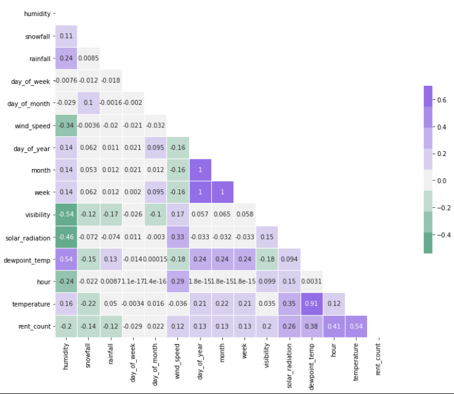
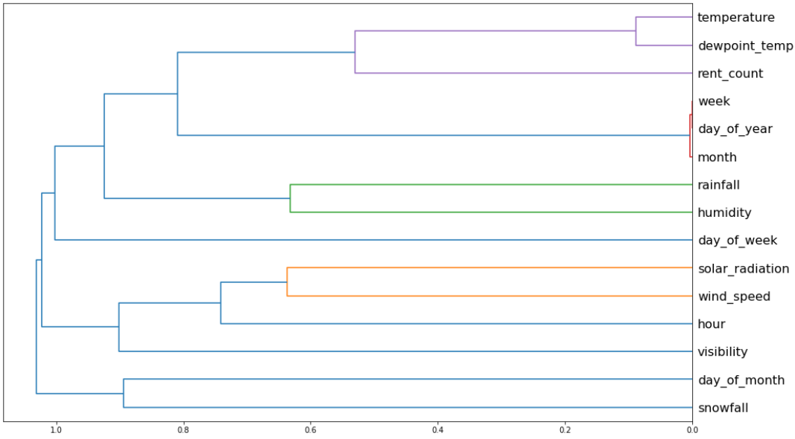

```{r setup, include=FALSE}
library(tidyverse)
library(gridExtra)
bike <- readRDS("../data/bike_clean.rds")
bike$season <- factor(bike$season, levels = c("Spring", "Summer", "Autumn", "Winter"))
```

We will first identify the variables in our bike data.

```{r, echo=FALSE, cache=TRUE}
glimpse(bike)
```

# Relationship among variables

The relationship among the continuous variables is as follows.





# Output vs Categorical Features
We look at the relationship between categorical variables and the output variable.

```{r, echo=FALSE, cache=TRUE}
p1 <- ggplot(bike) +
  geom_boxplot(aes(x = season, y = rent_count)) +
  labs(title = "Rent Count vs Season", x = "Season", y = "Rent Count")

holiday_count <- table(bike$holiday)
p2 <- ggplot(bike) +
  geom_boxplot(aes(x = holiday, y = rent_count)) +
  labs(title = "Rent Count vs Holiday", x = "Holiday", y = "Rent Count") +
  geom_text(aes(label = paste("n = ", as.character(holiday_count[1])), x = 1.3, y = 1000)) +
  geom_text(aes(label = paste("n = ", as.character(holiday_count[2])), x = 2.3, y = 1200))

grid.arrange(p1, p2, nrow = 1)
```

Given the large number of observations, the differences in rented bikes count is significant for different seasons and holiday status.


# Output vs Continuous Features

Here we investigate the relationship of the 3 most correlated variable with the output variable.

```{r, echo=FALSE, cache=TRUE}
ggplot(bike) +
  geom_point(aes(x = temperature, y = rent_count, colour = season), alpha = 0.5) +
  labs(title = "Rent Count vs Temperature", x = "Temperature (Celsius)", y = "Rent Count")

ggplot(bike) +
  geom_point(aes(x = solar_radiation, y = rent_count, colour = season), alpha = 0.5) +
  labs(title = "Rent Count vs Solar Radiation", x = "Solar Radiation (MJ/m^2)", y = "Rent Count")

ggplot(bike) +
  geom_point(aes(x = humidity, y = rent_count, colour = season), alpha = 0.5) +
  labs(title = "Rent Count vs Humidity", x = "Humidity (%)", y = "Rent Count")
```

# Distribution of Continuous Features

Next, we will investigate the distribution of the continuous variables.


```{r, cache=TRUE, echo=FALSE}
p3 <- ggplot(bike) +
  geom_histogram(aes(x = snowfall), binwidth = 5) +
  labs(title = "Distribution of Snowfall", x = "Snowfall (mm)")

p4 <- ggplot(bike) +
  geom_histogram(aes(x = rainfall), binwidth = 1) +
  labs(title = "Distribution of Rainfall", x = "Rainfall (mm)")

grid.arrange(p3, p4, nrow = 1)
```

As seen in the above images, the snowfall and rainfall are significantly dominated by zero (no rain or no snow). The distribution of the data is not erroneous, since Seoul indeed has such weather conditions.

```{r, echo=FALSE, cache=TRUE}
p5 <- ggplot(bike) +
  geom_histogram(aes(x = temperature), binwidth = 5) +
  labs(title = "Distribution of Temperature", x = "Temperature (Celsius)")

p6 <- ggplot(bike) +
  geom_histogram(aes(x = humidity), binwidth = 5) +
  labs(title = "Distribution of Humidity", x = "Humidity (%)")

p7 <- ggplot(bike) +
  geom_histogram(aes(x = wind_speed), binwidth = 0.2) +
  labs(title = "Distribution of Wind Speed", x = "Wind Speed (m/s)")

p8 <- ggplot(bike) +
  geom_histogram(aes(x = visibility), binwidth = 1000) +
  labs(title = "Distribution of Visibility", x = "Visibility (m)")

p9 <- ggplot(bike) +
  geom_histogram(aes(x = dewpoint_temp), binwidth = 5) +
  labs(title = "Distribution of Dewpoint Temperature", x = "Dewpoint Temperature (Celsius)")

p10 <- ggplot(bike) +
  geom_histogram(aes(x = solar_radiation), binwidth = 0.2) +
  labs(title = "Distribution of Solar Radiation", x = "Solar Radiation (MJ/m^2)")

grid.arrange(p5, p6, nrow = 1)
grid.arrange(p7, p8, nrow = 1)
grid.arrange(p9, p10, nrow = 1)
```

# Rent Count vs Datetime

```{r setup2, include=FALSE, cache=TRUE}
library(itsmr)
bike <- read.csv("../feature_engineering/seoulDate_dateEngin.csv") %>%
  as_tibble()
bike$season <- factor(bike$season, levels = c("Spring", "Summer", "Autumn", "Winter"))
bike$day_of_week <- factor(bike$day_of_week, levels = 0:6) 

bike2 <- bike %>%
  select(3:24) %>%
  select(1:5, 7, 16:20)
glimpse(bike2)
```

```{r, echo=FALSE, cache=TRUE}
bike2 %>%
  group_by(season, hour) %>%
  summarise(med_rent = median(rent_count), .groups = "keep") %>%
  ggplot() +
  geom_line(aes(x = hour, y = med_rent, colour = season)) +
  labs(title = "Median Daily Rentals by Seasons", x = "Hour of the Day",
       y = "Median Bike Rentals")
bike2 %>%
  group_by(day_of_week, hour) %>%
  summarise(med_rent = median(rent_count), .groups = "keep") %>%
  ggplot() +
  geom_line(aes(x = hour, y = med_rent, colour = day_of_week)) +
  labs(title = "Median Daily Rentals by Day of Week", x = "Hours",
       y = "Median Bike Rentals")
bike2 %>%
  group_by(holiday, hour) %>%
  summarise(med_rent = median(rent_count), .groups = "keep") %>%
  ggplot() +
  geom_line(aes(x = hour, y = med_rent, colour = holiday)) +
  labs(title = "Median Daily Rentals by Holiday", x = "Hours",
       y = "Median Bike Rentals")
```

```{r, echo=FALSE, cache=TRUE}
bike2 %>%
  group_by(day_of_month) %>%
  summarise(Median = median(rent_count),
            Average = mean(rent_count), .groups = "drop")%>%
  pivot_longer(cols = c("Median", "Average"),
               names_to = "type", values_to = "values") %>%
  ggplot() +
  geom_line(aes(x = day_of_month, y = values, colour = type)) +
  labs(title = "Bike Rentals by Day of Month", x = "Day of Month",
       y = "Aggregated Rental Count")

season_labs <- data.frame(x = seq(20, 365, 90),
                          y = rep(500, 4),
                          lab = c("Winter", "Spring", "Summer", "Autumn"))

bike2 %>%
  group_by(day_of_year) %>%
  summarise(total_rent = sum(rent_count), .groups = "drop") %>%
  mutate(smooth_total = smooth.ma(total_rent, q = 10)) %>%
  ggplot() +
  geom_line(aes(x = day_of_year, y = smooth_total)) +
  geom_vline(aes(xintercept = 60)) +
  geom_vline(aes(xintercept = 152)) +
  geom_vline(aes(xintercept = 244)) +
  geom_vline(aes(xintercept = 335)) +
  geom_text(data = season_labs,
            mapping = aes(x = x, y = y, label = lab)) +
  labs(title = "Bike Rentals by Day of Year", x = "Day of Year",
       y = "Smoothened Total per Day")
  
```

